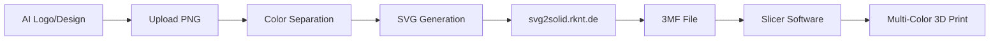

# 🎨 3D Print Color Separator

Transform your AI-generated logos and designs into multi-color 3D printable files with automatic color separation and layer generation.

🌐 **Live Demo**: [3dcolors.vlx.dk](https://3dcolors.vlx.dk)


## 🚀 Features

- **🎯 AI Logo Compatible**: Works perfectly with AI-generated designs and logos
- **🌈 Automatic Color Separation**: Intelligently separates colors into individual 3D printable layers
- **🔧 svg2solid Integration**: Direct compatibility with [svg2solid.rknt.de](https://svg2solid.rknt.de/) for 3D model conversion
- **🖨️ Multi-Material Ready**: Perfect for Prusa MMU, Bambu AMS, and manual filament changes
- **⚡ Real-time Processing**: Fast conversion with live progress tracking
- **📱 Responsive Design**: Beautiful interface that works on desktop and mobile

## 🛠️ Perfect For

- **Multi-color 3D printing** of logos and signs
- **AI-generated artwork** conversion to 3D models
- **Corporate branding** in physical form
- **Custom signage** with multiple filament colors
- **Educational projects** and prototyping

## 🎮 How It Works

1. **Upload** your PNG image (AI-generated logos work great!)
2. **Adjust** the number of colors (2-16, default: 4 for optimal 3D printing)
3. **Convert** with one click - automatic color separation and vectorization
4. **Download** your 3D print-ready SVG file
5. **Convert to 3D** using [svg2solid.rknt.de](https://svg2solid.rknt.de/)
6. **Slice and Print** with your favorite multi-material setup

## 🏗️ 3D Printing Workflow



## 🔧 Compatible With

- **Printers**: Prusa MMU, Bambu Lab AMS, Manual filament change printers
- **Slicers**: PrusaSlicer, Bambu Studio, Cura, SuperSlicer
- **Conversion**: svg2solid.rknt.de (automatic 3D model generation)
- **Formats**: SVG → 3MF → G-code

## 🚀 Getting Started

### Prerequisites
- Node.js 18+ 
- pnpm (recommended) or npm

### Installation

```bash
# Clone the repository
git clone https://github.com/yourusername/3d-print-color-separator.git

# Navigate to the web directory
cd 3d-print-color-separator/web

# Install dependencies
pnpm install

# Start development server
pnpm dev
```

Open [http://localhost:3000](http://localhost:3000) to start separating colors for 3D printing!

## 🏗️ Built With

- **[Next.js 15](https://nextjs.org/)** - React framework with TypeScript
- **[Tailwind CSS](https://tailwindcss.com/)** - Utility-first CSS framework
- **[shadcn/ui](https://ui.shadcn.com/)** - Beautiful, accessible components
- **[image-q](https://github.com/ibezkrovnyi/image-quantization)** - Advanced color quantization
- **[potrace](https://www.npmjs.com/package/potrace)** - SVG tracing and vectorization

## 📋 API Endpoints

- `POST /api/quantize` - Extract color palette from uploaded image
- `POST /api/trace` - Convert separated color layers to SVG paths

## 🎨 Example Use Cases

- **Company Logos**: Turn your brand logo into a multi-color 3D sign
- **AI Art**: Convert AI-generated artwork into physical 3D objects  
- **Signage**: Create professional multi-color signs and placards
- **Prototyping**: Rapid prototyping of colorful designs and concepts
- **Education**: Teaching color theory and 3D printing concepts

## 🤝 Contributing

Contributions are welcome! Please feel free to submit a Pull Request.

1. Fork the project
2. Create your feature branch (`git checkout -b feature/AmazingFeature`)
3. Commit your changes (`git commit -m 'Add some AmazingFeature'`)
4. Push to the branch (`git push origin feature/AmazingFeature`)
5. Open a Pull Request

## 🤖 Development Notes

This project was built using **spec-driven AI development** - essentially describing what I wanted and letting AI implement it. The entire application was created in 2-3 hours of non-coding time, which is pretty amazing.

**Technical Choices**: The code uses some older concepts like Next.js pages router and Tailwind CSS v3. Personally, I would have made different architectural decisions, but the AI chose a stable, well-documented approach that just works. Of course, the AI didn't know better since its knowledge will always be a bit behind current best practices.

**The Process**: Started with a simple spec, iteratively refined features, and ended up with a fully functional tool. It's fascinating how much can be accomplished without writing code directly.

**Shout out**: Big thanks to the developers of [Spec Kit](https://github.com/github/spec-kit) for pioneering spec-driven development approaches!

## 📄 License

This project is licensed under the MIT License - see the [LICENSE](LICENSE) file for details.

## 🙏 Acknowledgments

- **[svg2solid.rknt.de](https://svg2solid.rknt.de/)** - For excellent SVG to 3D conversion
- **3D Printing Community** - For inspiration and feedback
- **AI Art Community** - For creating amazing designs to convert

---

**Made with ❤️ for makers, designers, and 3D printing enthusiasts**

Transform any 2D design into beautiful multi-color 3D prints! 🎨🖨️
